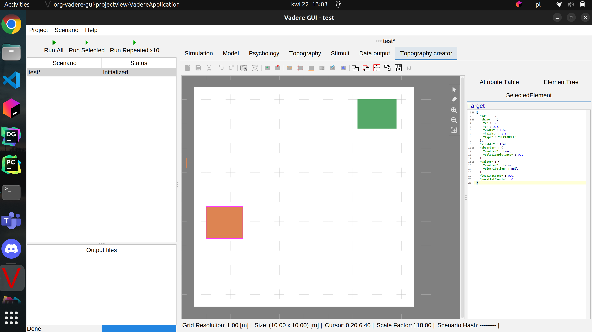

# MISS - temat projektu symulacja stacji kolejowej dworca głównego w Krakowie
## ETAP 1 Dziedzina problemu i analiza problemu
Problemem, którym będziemy się zajmować jest symulacja ruchu publicznego na stacji kolejowej dworzec główny w Krakowie.

Projekt polega na stworzeniu symulacji, w której poruszające się osoby starają się dotrzeć do swojego pociągu, bądź
dotrzeć do jednego z wyjśc na dworcu. W celu przeprowadzenia symulacji mozemy zdefiniowac kilka typów osób poruszających 
się po dworcu min:
1) Mieszkaniec Krakowa -> taka osoba jest obeznana z dworcem oraz trafia od razu do wyjścia albo do swojego pociągu
2) Turysta -> osoba, która nie jest obeznana w strukturze dworca i gubi się w drodze na pociąg
3) Pracownik dworca -> osoba która porusza się po dworcu ale nigdy nie wchodzi do pociągu po pewnym czasie zmienia się
ze swoim kolegą
4) Osoba o wózkach inwalidzkich -> osoby potrafiące znaleźć pociąg ale poruszają się dużo wolniej niż inni

Co próbujemy rozwiązać ?
Postaramy się odpowiedzieć na pytanie czy struktura dworca w Krakowie jest optymalna dla różnych typów pasażerów,
min. czy potrafią się odnaleźć np. Turysta podąża do punktu z informacją aby odnaleźć swój pociąg/wyjście.
Stworzenie statysyk ile osób jest w stanie zdążyć na pociąg w zaleźności od czasu w jakim pociąg pozostaje na stacji.

## Analiza dostepnych narzędzi na rynku
1) https://www.vadere.org/ -> docelowo jest to narzędzie symulujące tylko luch ludzi z punktu a do punktu b. Jednakże 
jest ono narzędziem open-source co pozwala nam na dopisanie własnych elemntów kodu. Posiada możliwość stworzenia prostej 
planszy gdzie jednstki mogą się porsuszać. System dodanie zachowania dla stworzonej jednkstki jest dosyć prosty, 
a mianowicie należy dodac tylko nową klasę z definiowanymi z interfesju metodami. Mimo iż narzędzie nie posiada
w swoim systemie wbudowanego systemu pociągów będziemy w stanie zdefiniować nasza stacje w taki sposób aby zasumulowac  
przyjazd i odzjazd pociągów. na ten moment wydaje się to być najbardziej zbliżone narzedzię do symulacji naszego 
problemu.
2) https://www.anylogic.com/ -> narzędzie pozwala nam na zasymulowanie stacji kolejowej, jendkże bardziej skupia się na 
wizualizacji 3D niż nad samym problemem poruszania się na stacji. Nie posiada wystarczającej liczby opcji, która 
pozwalała by nam na przeprowadzenie wcześniej zdefiniowanych problemów i analizy. Niestety dodatkowo nie wydaje się  
posiadać opcji dodania dodatkowcyh funkcjonalności do kodu, czyli zaimplementowania naszych typów osób przebywających na 
dowrcu. W przypadku gdy narzędzie nr 1 nie pozwoli nam w dalszej części na relaizację projektu (odkryjemy jego 
mankamenty) jest to 2 narzedzie w kolejce do użycia.
 

3) http://www.opentrack.ch/mobile/opentrack_e/opentrack_e.html -> narzędzie pozwla na symulację stacji kolejowych. 
Jednakże polega na symualcji całej lini przejazdu od przystanku początkowego do kończowego. Dlatego bardziej nadaje się 
do symulacji metra w mieście. Dodatkow nie posiada możliwości zdefiniowania wyglądu stacji na czym najbardziej nam 
zależy.
 

4) https://www.simwalk.com/pricing/index.html -> narzędzie pozwala na symualcję ruchu ludzi. Posiada nawet rozszerzenia 
związane z pociągami i stacjami kolejowymi. Jednakże narzędzie jest płatne a nawte dosyć drogie, skierowane do dużych 
korporacji, którym zależy na przeprowadzaniu symulacji na dużą skalą, niż do celów akademickich.

5) Oprócz ww. progamów można bylo również znaleźć wszelakie gry jak https://www.xbox.com/pl-PL/games/store/
train-station-simulator/9nt9zxq4hz0j train station simulator. Gra pozwala na budowanie własnej stacji dodając różne 
sklepy oraz dodatkowe tory dla większej ilości pociągów. Jednakże uzycie jej w naszym projeckie mimo możliowsci 
zaprojektowania dosyć specyficznej stacji jest niemożliwe z pwodo braku zdefiniowania rodzaji pasażerów.

Podsumowując mimo sowich niedoskonałości postanowiłem uzyć narzędzia vadere (nr 1). Jest ono napisane w javie
czyli języku mi zaznajomionym, oraz jest w bardzo prosty sposób modyfikowalne. jednym z większych probelmów podczas 
symulacji może okazać sie stowrzenie systemu pociagów przyjeżdżającyh na stację. W przypadku gdy narzędzie nie udostepni 
takich mozliwości postarm sie zrealizowac symulacje za pomocą any logic (nr 2)

## Określone cele i zakres prac, uruchomione narzędzia

Cele:
1) Stworzenie topografi przypominającej dworzec główny w Krakowie
2) Dodanie wszytkich nowych klas osób będących na stacji kolejowej
3) Stworzenie miejsca docelowego pociąg, które jest otwarte tylko w okreslonym czasie
4) Przeprowadzenie symulacji dla stworzonej topografi dostosowując odpowiednie klasy do osób na dworcu, i stworzenie statystyk, najwiekszego zatłoczenia miejsca dowrca
5) Potecjalne modyfikiacje topografi w celu rozrzedzenia ruchu i powtrzymanie sytuacji gdy osoba nie zdąża na pociąg

Po uruchomienu programu vadere możemy stworzyć topografię, gdzie zielone obiekty są obiektami tworzacymi osoby na naszym dworcu a czerwone obiekkty 
to obiekty przetwarzające nasze jednostki. 

## Etap 4: prototyp, działające pierwsze elementy

Niestety narzędzie Vadere podczas próby zaimplementowania oczekiwanego załozenia. Narzędzie okazało się zbyt trudne i toporne w obsłudze dodatkowo brak tutoriali
w internecie spowodował, że zrezygnowałem z używania Vadere. Postanowiłem użyć narzędzie nr 2 AnyLogic.
Ładując prosty przykład jesteśmy w stanie stworzyć symulację przyjeżdżających odjeżdżających pociągów oraz ludzi przybywających na stację koleji.
Aby spełnić założenia naszego eksperymentu należy zmienić strukturę stacji aby spełniała wygląd Stacji Głównej w Krakowie. Niestety
Any Logic nie zapewnia nam modyfikacji psychologi tłumu, zatem projekt będzie opierał się na optymalizacji samej stacji kolejowej.
